# CareSync — Hospital Management System

<p align="center">
  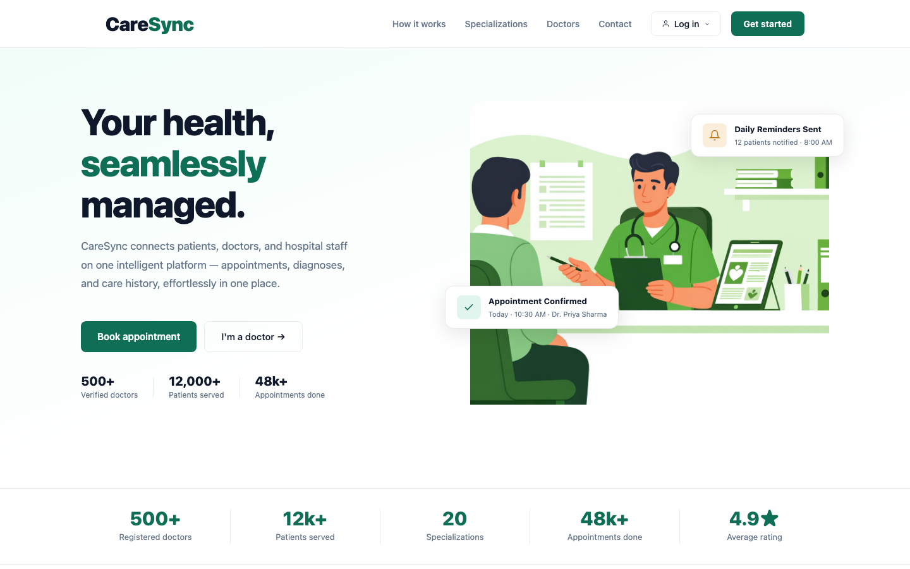
</p>

<p align="center">
  <a href="#quick-start-guide"></a>
  <a href="#tech-stack--architecture"></a>
  <a href="#tech-stack--architecture"></a>
  <a href="#tech-stack--architecture"></a>
  <a href="LICENSE"></a>
</p>

---

## 📌 Executive Summary
**CareSync** is an enterprise-grade Hospital Management System (HMS) engineered with Vue 3, Vite, Flask, and SQLAlchemy. It provides role-tailored workflows for **Patients**, **Doctors**, and **Hospital Administrators**, handling appointment booking, electronic health records (EHR), prescription management, doctor availability scheduling, department analytics, and background report exports.

---

## 🔑 Demo Credentials

> [!TIP]
> Run `python seed_data.py` to populate the local database with rich mock data across all roles.

| Role | Username / Email | Password | Primary Access Scope |
| :--- | :--- | :--- | :--- |
| 🛡️ **Administrator** | `admin` | `Admin@1234` | Full hospital metrics, doctor/patient management, appointments control, exports |
| 🩺 **Doctor** | `doctor@hospital.local` | `Doctor@1234` | Patient queue, prescription authoring, slot scheduling, performance reports |
| 👤 **Patient** | `patient@hospital.local` | `Patient@1234` | Specialist search, appointment booking, medical history, EHR export |

---

## ✨ Feature Matrix

### 👤 Patient Portal
- **Specialist Discovery & Search**: Filter doctors by department, specialization, rating, and real-time availability.
- **Instant Appointment Booking**: Interactive slot selection with double-booking prevention.
- **EHR & Medical History**: Access diagnosis logs, digital prescriptions, clinical notes, and treatment timelines.
- **Personalized Profile & Insurance**: Manage insurance policies, emergency contacts, blood group, allergies, and consents.
- **Health Record Export**: One-click background generation and PDF export of comprehensive health records.

### 🩺 Doctor Portal
- **Interactive Clinical Dashboard**: Real-time summary of today's appointments, pending consultations, and stats.
- **Prescription & Diagnosis Workbench**: Log clinical notes, issue prescriptions with dosage details, and assign follow-ups.
- **Availability Management**: Configure working hours, max booking slots per date, and custom schedules.
- **Patient Roster**: Access historical patient medical histories, allergies, and past visit summaries.
- **Monthly Performance Reports**: Automatic monthly PDF summary generation for clinical audits.

### 🛡️ Admin Portal
- **Executive Operations Dashboard**: Hospital-wide telemetry for active doctors, registered patients, and appointment volume.
- **Doctor Management**: Onboard new physicians, update qualifications, set consultation fees, and assign departments.
- **Patient Registry**: Searchable global directory with account blacklisting/suspension capabilities.
- **Department Telemetry**: Manage medical departments, descriptions, and assigned clinical staff.
- **Export Jobs & Report Audits**: Real-time status monitoring for background record exports and report downloads.

---

## 📸 Visual Showcase & Interface Galleries

### 👤 Patient Portal
| Overview & Dashboard | Find Doctors & Booking |
| :---: | :---: |
| 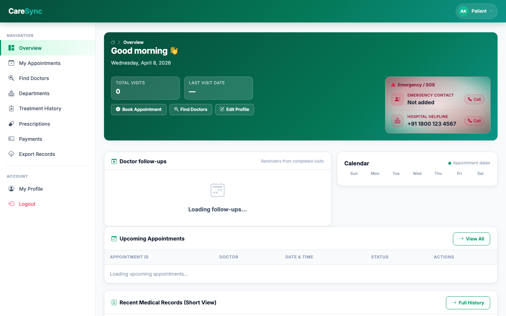 | 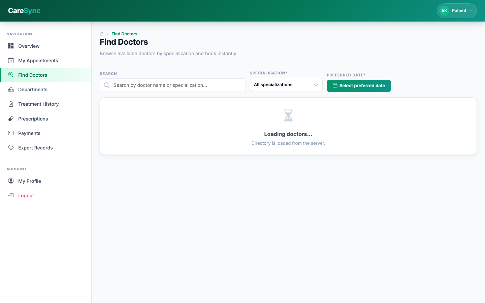 |

| Treatment History | Prescriptions & EHR |
| :---: | :---: |
| 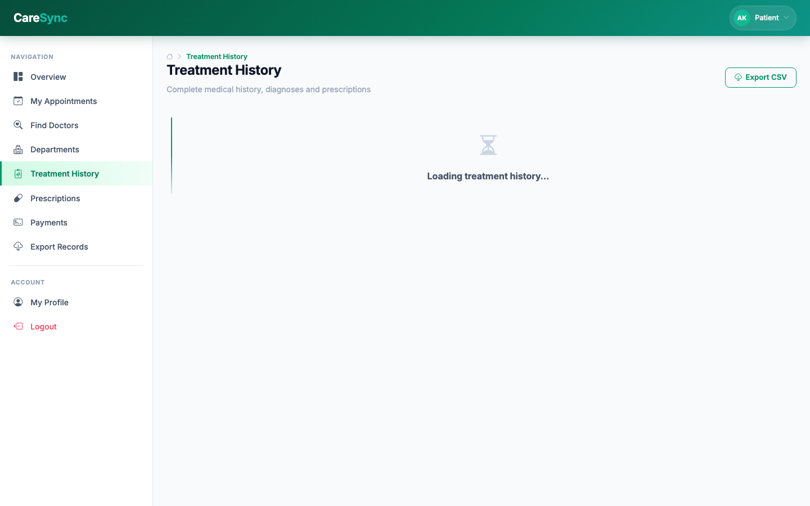 | 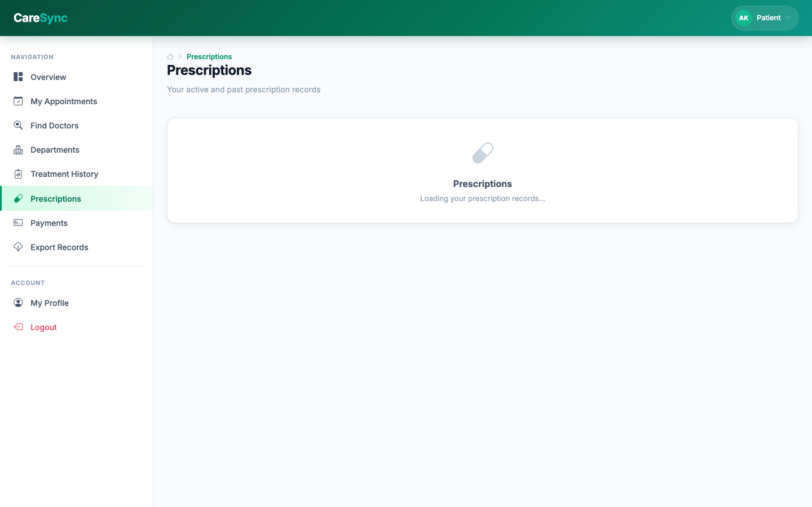 |

---

### 🩺 Doctor Portal
| Clinical Dashboard | Appointments Management |
| :---: | :---: |
| 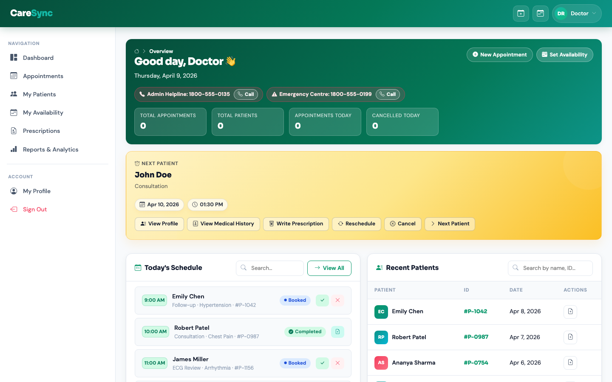 | 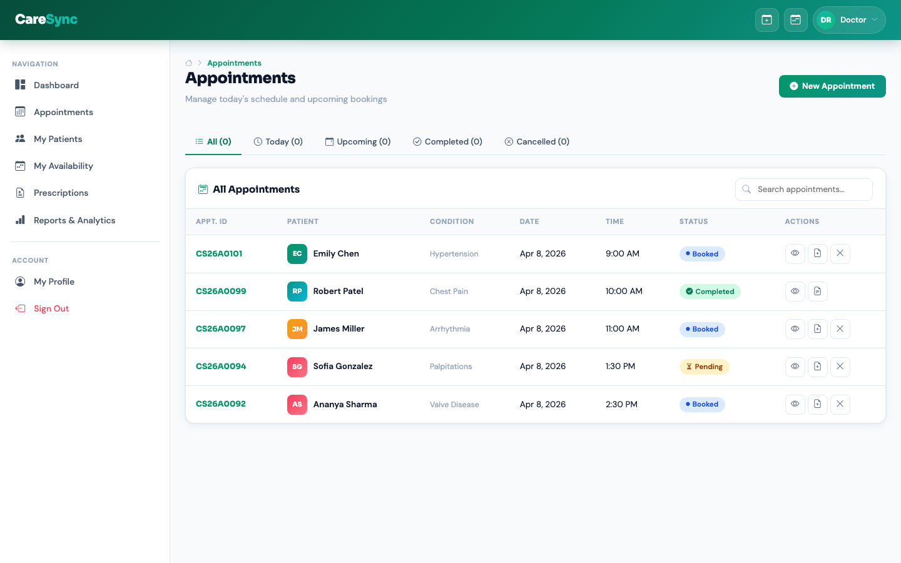 |

| Availability Scheduler | Prescriptions & Consultations |
| :---: | :---: |
| 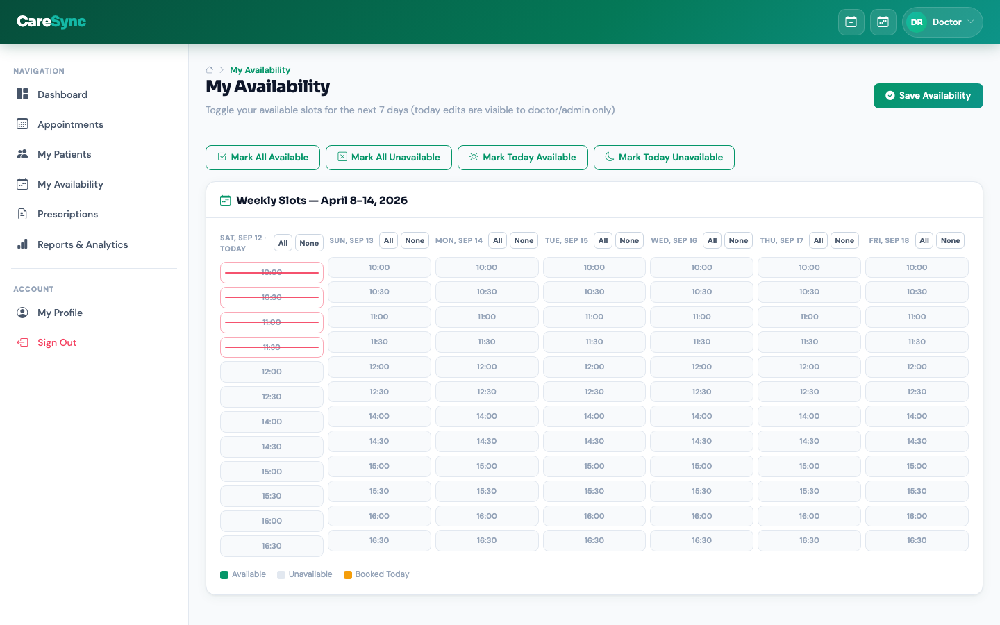 | 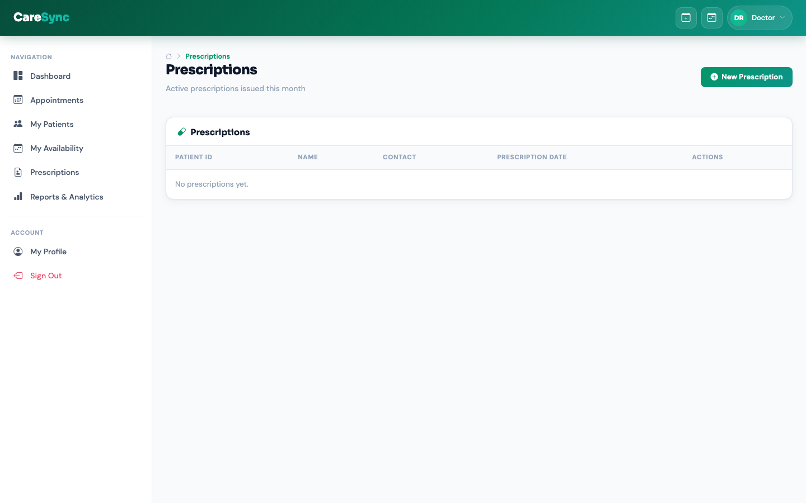 |

---

### 🛡️ Admin Portal
| Executive Overview | Doctor Management |
| :---: | :---: |
| 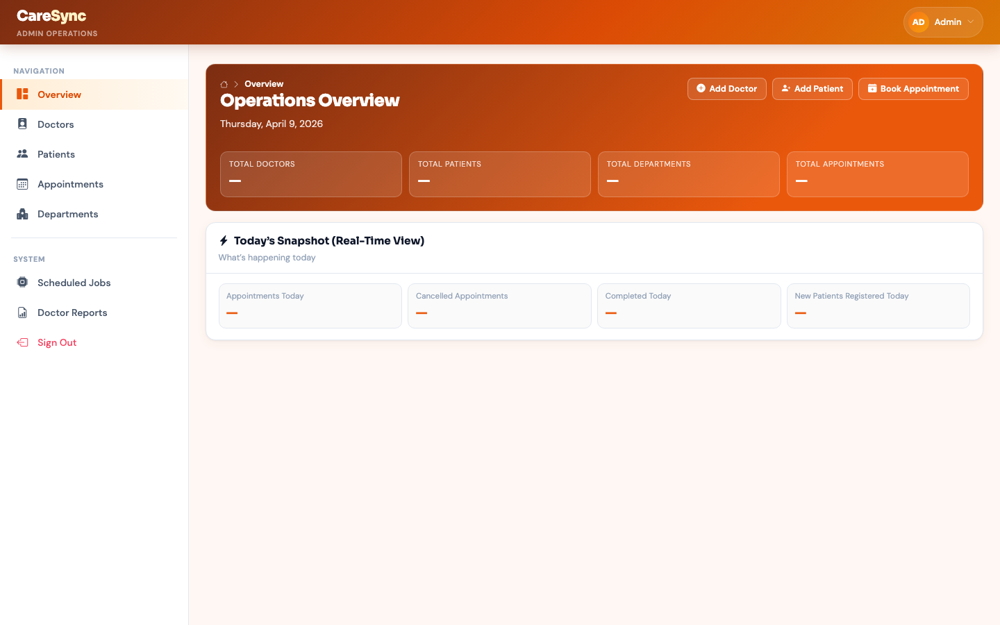 | 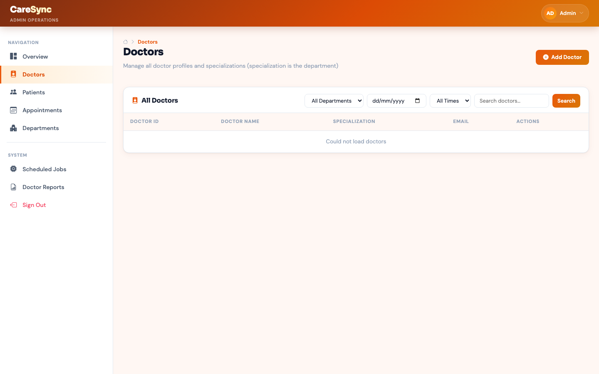 |

| Patient Registry | Appointments Audit |
| :---: | :---: |
| 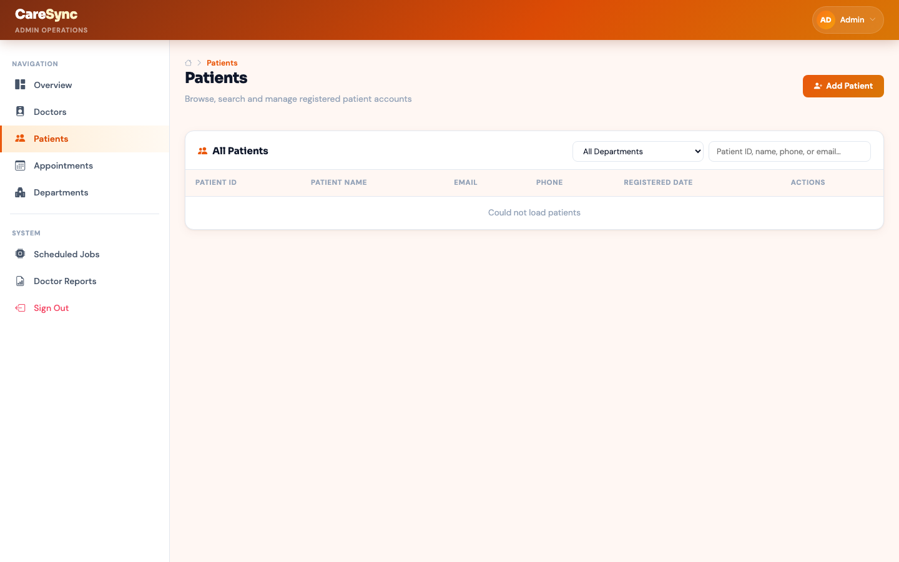 | 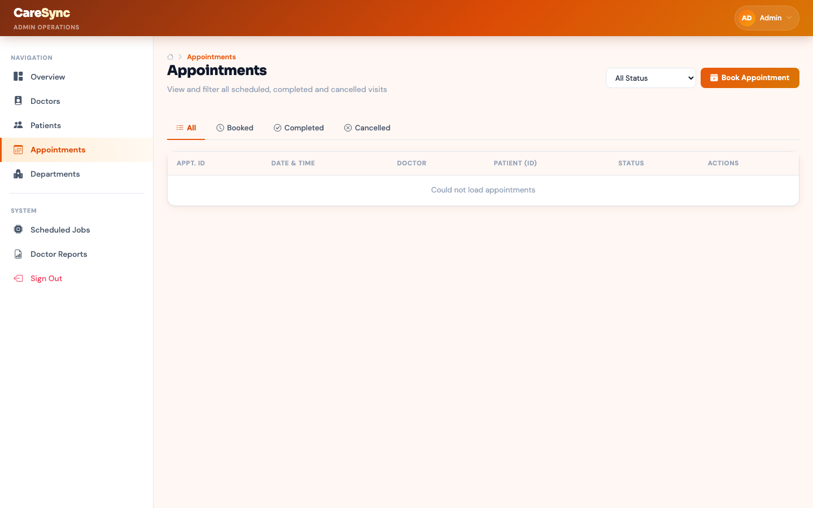 |

---

## 🛠️ Tech Stack & Architecture

| Layer | Technology | Details |
| :--- | :--- | :--- |
| **Frontend** | Vue 3 + Vite | Single Page Application (SPA), Vue Router, Responsive CSS Design System |
| **Backend** | Python Flask | RESTful API Architecture, JWT Authentication, SQLAlchemy ORM |
| **Database** | SQLite / PostgreSQL | Structured relational schema with automated sequence UID generators |
| **Task Queue** | Celery + Redis | Asynchronous record exports and scheduled monthly report generation |
| **Automation** | Playwright | End-to-End screenshot suite and interface verification |

---

## 📂 Repository Structure

```tree
CareSync-hospital-management-system/
├── assets/
│   └── screenshots/        # High-resolution UI screenshots (1440x900)
├── backend/
│   ├── app.py              # Flask Application Factory & Route Registration
│   ├── create_db.py        # Database Schema Initialization
│   ├── models.py           # SQLAlchemy Models (User, Doctor, Patient, etc.)
│   ├── requirements.txt    # Python Dependencies
│   ├── auth/               # Authentication Routes & JWT Logic
│   └── routes/             # Admin, Doctor, and Patient REST Controllers
├── frontend/
│   ├── index.html          # HTML Entrypoint
│   ├── package.json        # Node.js Dependencies & Vite Scripts
│   ├── vite.config.js      # Vite Configuration
│   ├── designs/            # Custom Theme Components & HTML Layouts
│   └── src/                # Vue 3 App, Router, Views, and Components
├── instance/
│   └── hms.db              # SQLite Database Storage
├── seed_data.py            # Rich Mock Data Generator Script
├── start.sh                # Single-command local startup script
└── README.md               # Repository Documentation
```

---

## ⚡ Quick Start Guide

### Prerequisites
- **Python**: 3.10+
- **Node.js**: 18+ (with npm)

### 1. Clone Repository & Setup Environment
```bash
git clone https://github.com/your-username/CareSync-hospital-management-system.git
cd CareSync-hospital-management-system

# Set up Python virtual environment
python3 -m venv .venv
source .venv/bin/activate  # On Windows: .venv\Scripts\activate

# Install backend dependencies
pip install -r backend/requirements.txt
```

### 2. Seed Database with Realistic Data
```bash
python seed_data.py
```

### 3. Start Application
Option A — Using Startup Script:
```bash
chmod +x start.sh
./start.sh
```

Option B — Manual Terminal Start:
```bash
# Terminal 1: Backend
python3 -m backend.app

# Terminal 2: Frontend
cd frontend
npm install
npm run dev
```

Open your browser at **`http://localhost:5173`**.

---


---

## 📄 License
This project is licensed under the [MIT License](LICENSE).
